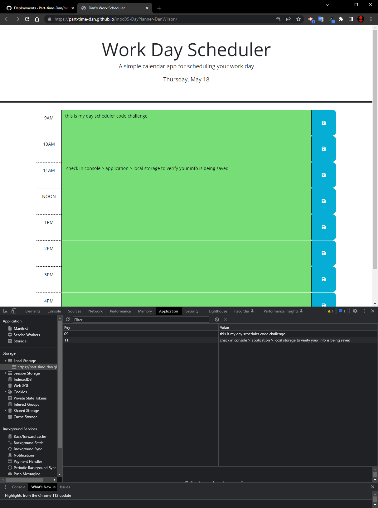

# mod05-DayPlanner-DanWilson

## Description
Module 05 challenge for bootcamp to refactor and add code to existing site so the day planner has dynamic functionality and stores/calls user input

Objectives:

- Current day should be displayed at the top of the calendar using Dayjs API
- Timeblocks displayed as standard business hours color coded to past, present and future events
- Clicking on a timeblock allows you to input information
- Clicking the save buttons keeps that information in local storage
- The information is persistent and shows upon refresh

## Installation

N/A

## Usage

Visit the site here [Dan's Work Scheduler](https://part-time-dan.github.io/mod05-DayPlanner-DanWilson/)

Timeblock colors should correspond to the time of day according to past, present and future. Timeblocks from previous hours will appear grayed out, the current timeblock (or NOW) shows up red, and all future timeblocks are green. Click into the colored space of the timeblock, type in text, then click the save button to the right of that timeblock. Open the console and look to the Application tab > Local Storage to see the data being stored. Refresh the page to see any saved inputs remain on the page.

(Working on an additional function to have the timeblock colors update in real-time, not just on refresh after a new hour has begun, but this is outside the scope of the assignment.)

## License

N/A

## Deploy Git Page Screenshot

